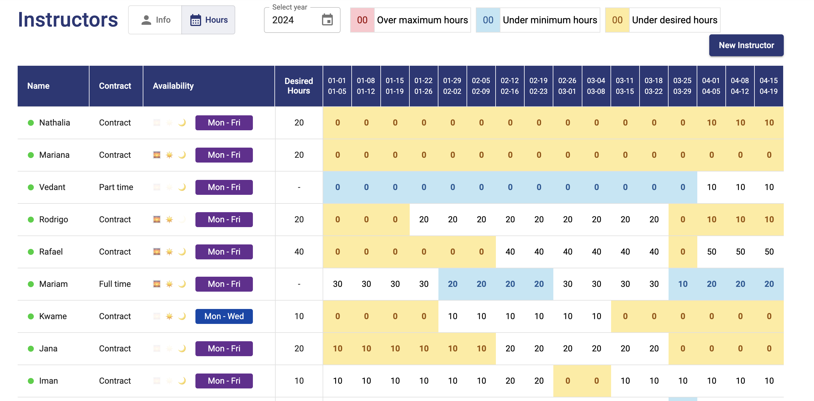

# Program Schedular App (Program365)

## What does this application do?

This application supports user (Program Manager in a collage) to schedule the programs, including the schedule of instructor.

## What is the tech stack of this application?

## What are the features of this application?

### All in one operation

User can compare and arrange the schedule of each class in a single page

<video width="320" height="240" controls>
  <source src="./assets/all-in-one.mov" type="video/mp4">
Your browser does not support the video tag.
</video>

### Accurate validation

User can ensure that arranged schedule meets all the constraints with 14 validation feedbacks and real-time preview.

<video width="320" height="240" controls>
  <source src="./assets/valdation.mov" type="video/mp4">
Your browser does not support the video tag.
</video>

### Instructor schedule visualization

User can see how each instructor is assigned to classes to avoid over or under assignment.

