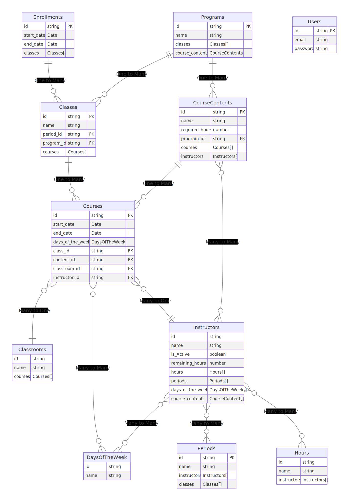

# ERD

[Link to ERD(Excaildraw)](https://excalidraw.com/#json=qmhnC9yewSRj1JUh_p9YQ,9HtJNZLuilM9Xc_nhYiJIA)

## Users

- User of this application (Rodrigo)
- If each instructors needs to create an account, we can add Role to here,

#### Schema

id : **string**
email : **string**
password : **string**

## Enrollments

- Indicates when students are admitted and the duration of the Program
- This is a parent concept of Class, thus Enrollment has multiple classes
  (m1-0124-web, m2-0124-web, a1-0124-web, etc...)

#### Example

- 2023 winter, 2024 spring

#### Schema

- id : **string**
- start_date : **Date**
- end_date : **Date**
- classes : **Classes** (One to Many)

## Programs

- Each one of the classes are defined as 1 specific program
- Set of CourseContents for each classes will be different, depending on the Program

#### Example

- A1-0124

#### Schema

- id : **string**
- name : **string**
- classes : **Classes** (One to Many)
- course_contents : **CourseContents** (One to Many)

## CourseContents

- Content of course
- Have its name, required hours, topic

#### Example

- Campaign Management, Digital Marketing 1, Digital Marketing 2, SEO

#### Schema

- id : **string**
- name : **string**
- required_hours : **number**
- program_id : **string** (FK for program)
- courses : **Course** (One to Many)
- instructors: **Instructors** (Many to Many)

## Classes

- Have a concept of the time of day, the class group, the day it began, and the category.

#### Example

- m1-0124-web -> morning class of web dev 1 starts from Jan 24
- m2-0124-web -> morning class of web dev 2 starts from Jan 24
- a1-0124-web -> afternoon class of web dev starts from Jan 24
- e1-0124-web -> evening class of web dev starts from Jan 24
- In our case, it's a2-0523-web

#### Schema

- id : **string**
- name : **string**
- period_id : **string** (FK for Periods)
- program_id : **string** (FK for program)
- courses : **Course** (One to Many)

## Periods

- Concept of the time of day.
- There are only three values.(Morning, Afternoon, Evening)

#### Schema

- id : string
- name : **string**
- instructors : **Instructors[]**
- classes : **Classes[]**

## Courses

- The frame consists of `CourseContent`, `classroom`, and so on
- Has a flexible period specifying "start date" and "end date"

#### Schema

- id : **string**
- start_date : **Date**
- end_date : **Date**
- days_of_the_week : **DaysOfTheWeek** (Many to Many)
- class_id : **string** (FK for Class)
- content_id : **string** (FK for CourseContent)
- classroom_id : **string** (FK for Classroom)
- instructor_id : **string** (FK for Instructor)

## DaysOfTheWeek

- Concept of the days of the week.
- There are only five values.(Mon ~ Fri)

#### Schema

- id : **string**
- name : **string**

## Classrooms

#### Schema

- id : **string**
- name : **string**
- courses : **Courses** (One to Many)

## Instructors

#### Schema

- id : **string**
- name : **string**
- is_Active : **boolean**
- hours : **string**
- periods : **Periods** (One to Many)
- days_of_the_week : **DaysOfTheWeek** (One to Many)
- course_content : **CourseContent** (One to Many)
- remaining_hours : **number**

## Hours

- Maximum hours of work per week
- There are only four values.(10h,20h,30h,40h)

#### Schema

- id : **string**
- name : **string**
