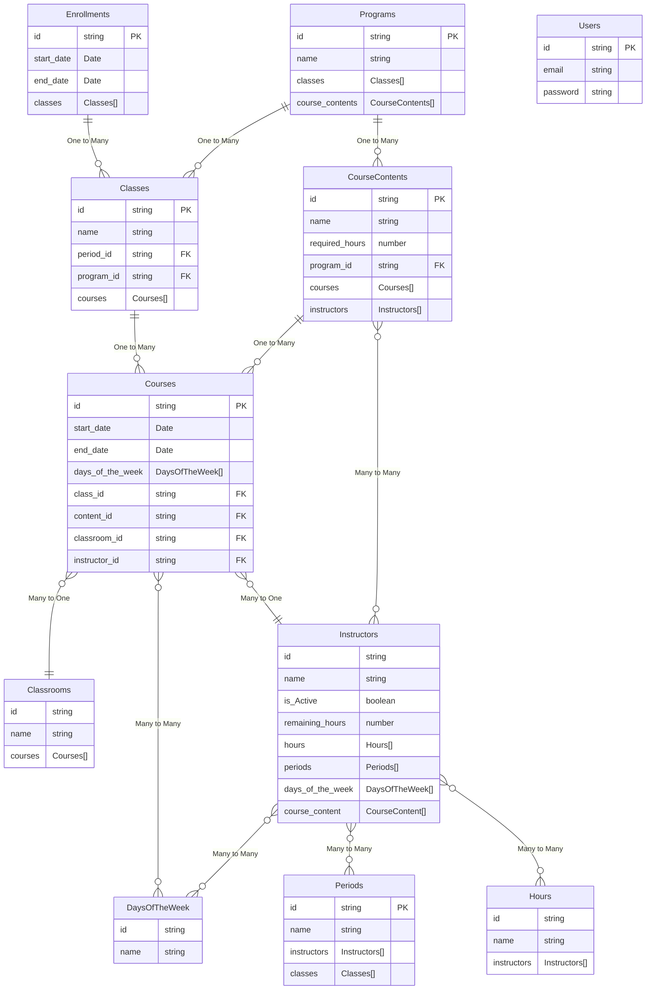

```mermaid
erDiagram
    Programs ||--o{ CourseContents : "One to Many"
    Enrollments ||--o{ Classes : "One to Many"
    Programs ||--o{ Classes : "One to Many"
    Classes ||--o{ Courses : "One to Many"
    Courses }o--o{ DaysOfTheWeek : "Many to Many"
    Courses }o--|| Classrooms : "Many to One"
    Courses }o--|| Instructors : "Many to One"
    CourseContents ||--o{  Courses : "One to Many"
    Instructors }o--o{ CourseContents : "Many to Many"
    Instructors }o--o{ Periods : "Many to Many"
    Instructors }o--o{ Hours : "Many to Many"


    Instructors }o--o{ DaysOfTheWeek : "Many to Many"

    Users {
        id string PK
        email string
        password string
    }

    Enrollments {
        id string PK
        start_date Date
        end_date Date
        classes Classes[]
    }

    Programs {
        id string PK
        name string
        classes Classes[]
        course_contents CourseContents[]
    }

    CourseContents {
        id string PK
        name string
        required_hours number
        program_id string FK
        courses Courses[]
        instructors Instructors[]
    }

    Classes {
        id string PK
        name string
        period_id string FK
        program_id string FK
        courses Courses[]
    }

    Periods {
        id string PK
        name string
        instructors Instructors[]
        classes Classes[]
    }

    Courses {
        id string PK
        start_date Date
        end_date Date
        days_of_the_week DaysOfTheWeek[]
        class_id string FK
        content_id string FK
        classroom_id string FK
        instructor_id string FK
    }

    DaysOfTheWeek {
        id string
        name string
    }

    Classrooms {
        id string
        name string
        courses Courses[]
    }

    Instructors {
        id string
        name string
        is_Active boolean
        remaining_hours number
hours Hours[]
        periods Periods[]
        days_of_the_week DaysOfTheWeek[]
        course_content CourseContent[]

    }

    Hours {
        id string
        name string
instructors Instructors[]
    }
```
