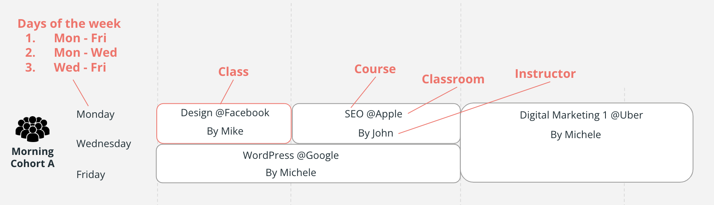

# Terminology

| Terms                             | Description                                                                                        | Example                                                            |
| --------------------------------- | -------------------------------------------------------------------------------------------------- | ------------------------------------------------------------------ |
| Intake                            | Indicates when students are admitted and the duration of the Program                               | 2023 November intake                                               |
| Program                           | There are only two programs in Digital Marketing                                                   | DMS(Digital Marketing Specialist), DMA(Digital Marketing Advanced) |
| Cohort                            | Concept which contains name, the period of day, the list of classes, and which program it belongs. | m1-0124-web -> morning class of web dev 1 starts from Jan 24       |
| Course                            | Learning contents / subject.                                                                       | Campaign Management, Digital Marketing 1, Digital Marketing 2, SEO |
| Classroom                         | Where class is placed.                                                                             | Facebook, Google, Microsoft                                        |
| Class                             | Chunk of day-to-day class which have course, instructor, term(start date and end date)             |                                                                    |
| Instructor                        | People who teach courses in Digital Marketing Program                                              | Diogo, Caio, Mariam                                                |
| Period of day                     | Concept of the time of day.                                                                        | Morning, Afternoon or Evening                                      |
| Days of the week (weekdays range) | Range of days                                                                                      | Mon-Fri, Mon-Wed, or Wed-Fri                                       |
| Schedule                          | List of classes, belonging to a cohort.                                                            |                                                                    |
